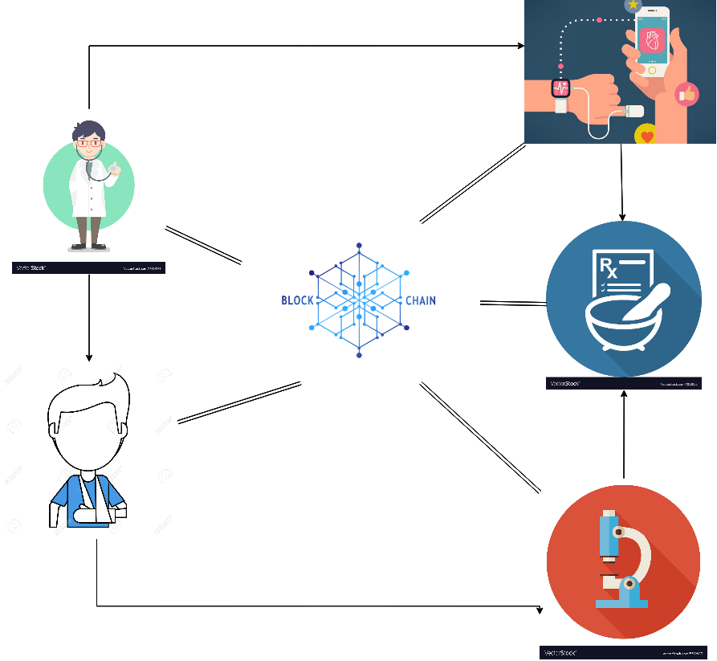

Ứng Dụng Lưu Trữ và Truy Cập Thông Tin Hồ Sơ Bệnh Án trên Nền Tảng BLOCKCHAIN.
========

Hệ Thống Cung Cấp Quy Trình lưu trữ thông tin bệnh án, Với các đối
tượng tham gia hệ thống như: Nhân Viên Quản Lý Bệnh Viện, Bệnh Nhân, 
Phòng Nghiên Cứu, Phòng Pha Chế Thuốc, Bảo Hiểm, ..

Tất cả đều được lưu trữ phân tán trên hệ thống, giúp minh bạch hóa 
và bảo mật dữ liệu bệnh nhân cần thiết.

Công Nghệ Sử Dụng
-------

* [NodeJS](https://nodejs.org/en/) - BackEnd Server
* [MongoDB](https://www.mongodb.com/) - Database
* [Android](https://www.android.com/) - Build App Mobile

Dịch Vụ/Package (ThirdParty)
-------

* [Gearman](http://gearman.org/) - Thực Thi các tiến trình chạy nền
* [GPG](https://www.openpgp.org/software/) - Mật Mã Khóa Công Khai
* [IPFS](https://ipfs.io/) - Giao Thức Lưu Trữ Phân Tán
* [QR-Code](https://github.com/soldair/node-qrcode) - QR-Code Generator

### Video Demo  
Video Hướng Dẫn Quy Trình hoạt động Ứng Dụng trên nền tảng Web App và Mobile App
[Xem Tại Đây](https://www.youtube.com/watch?v=--tHAxwb9EM&t=1s)
